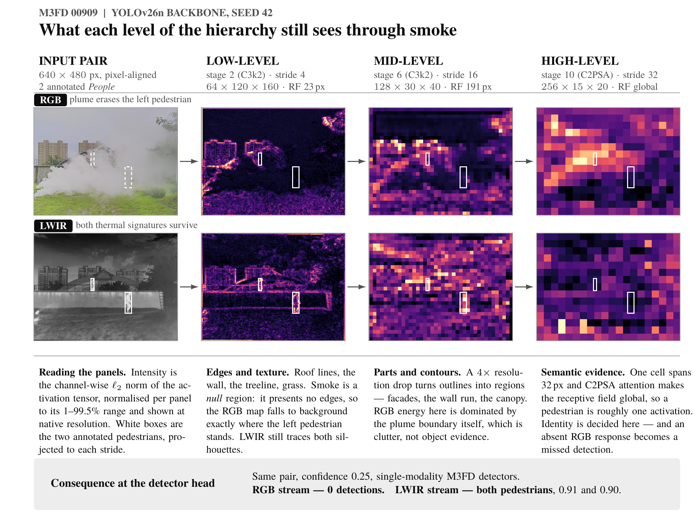
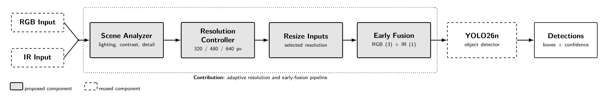

# Dynamic-Resolution Control for RGB/IR Early-Fusion Object Detection

*Using input resolution as a per-image runtime setting on the accuracy–latency–energy trade-off of a four-channel RGB+LWIR detector, measured on a workstation GPU and a Jetson Orin.*

**Course:** CSCE 585 — Machine Learning Systems
**Author:** Jacob Whisenant, PhD student, Department of Mechanical Engineering, University of South Carolina
**Project type:** Type 4 — exploration of an open systems question (efficiency and sustainability of adaptive inference)
**Proposal date:** September 4, 2026

---

## Team and Responsibilities

This is a **one-person project**. The sole team member is a PhD student in Mechanical Engineering whose doctoral work is in computer vision. All roles belong to that one person: system design, implementation, running experiments, measurement, analysis, and writing.

**Relevant background.** The doctoral work covers multi-modal RGB/infrared object detection, detector training in PyTorch, and GPU experiment management. The skills this project needs are careful latency and energy measurement on real hardware, controlled experimental design, and disciplined reproducibility. Those skills also draw on mechanical-engineering training in instrumentation and experiment design. The [Proposed System or Approach](#proposed-system-or-approach) section separates the open-source components this project builds on from the components it contributes.

**Coordination and accountability.** A solo project has no teammate to act as a checkpoint, so the following mechanisms replace that role:

| Mechanism | Cadence | Artifact |
|---|---|---|
| Written progress note | Every Friday | Dated entry added to `README.md`: what ran, what the numbers were, what is blocked |
| Milestone commit | Per milestone | One tagged commit per row of the [timeline](#timeline-and-milestones), naming the completion evidence |
| Experiment log | Per run | Append-only `results/experiment_log.csv` — run ID, git SHA, config path, seed, device, date, outcome |
| Advisor check-in | Biweekly | Scope and methodology review; confirmation that the experimental design supports the claims |

Working alone is itself a schedule risk, because no one else can absorb a delay. It is listed with a mitigation and a fallback in [Risks and Mitigations](#risks-and-mitigations).

---

## Feedback Received and Responses

---

## Problem and Motivation

**System context.** RGB/LWIR early-fusion detectors run on platforms with limited compute, latency, and power: mobile robots, UAVs, driver-assistance stacks, and fixed surveillance nodes. On these platforms the detector is not an offline batch job. It is a service that must return detections for every frame within a latency budget and a fixed power envelope.

**Current limitation.** Nearly every published RGB/IR fusion detector is trained and served at a **single fixed input resolution**. Every frame is resized to 640 px and pays the full cost of that resolution, no matter what the frame contains. M³FD, however, is built as a *multi-scenario* benchmark. It covers daylight, night, overcast, fog, and smoke, with object sizes ranging from a distant pedestrian a few pixels tall to a bus filling half the frame. It is unlikely that all 4,200 of these scenes need the same amount of spatial detail.

**Early evidence that the cost of downsampling depends on the scene.**

*Figure 1. One M³FD pair (frame 00909, two annotated `People`) passed through the YOLOv26n backbone at stride 4, 16, and 32. Panels show channel-wise L2 activation energy. White boxes mark the annotated pedestrians at each stride. Produced for the August 28 idea presentation.*

Figure 1 shows two things. First, large structures tolerate resolution loss: building facades, the wall, and the tree canopy remain recognizable regions after the 4× stride increase from mid- to high-level, because the evidence supporting them is coarse. Second, small objects do not tolerate it: at stride 32 one activation cell covers 32 px, so an annotated pedestrian shrinks to about one activation, and any further loss removes the object. **The cost of downsampling therefore depends on scene content, not on the model alone.** That is the condition under which a per-image runtime decision can help. This is one illustrative frame, not a measured result. Measuring the effect across the dataset is the job of RQ1.

**Why this is a systems problem rather than a modelling problem.** The project does not propose a better fusion architecture or aim for higher mAP. The fusion mechanism stays fixed. The question is about serving a trained detector: given a per-frame latency budget, is input resolution a useful runtime setting, how much is it worth, how much does the decision itself cost, and does the answer change with the hardware? These questions concern the operating point of a deployed system. Answering them requires measured wall-clock latency, memory, and energy on real devices, not FLOP counts.

**Broader impacts.** Two risks are worth stating. First, **safety**. A controller that lowers resolution to save energy harms small-object detection first, and in M³FD the smallest objects are mostly in the `People` class. An acceptable-looking aggregate mAP can hide a serious drop in pedestrian recall. Small-object AP and `People` recall are therefore reported separately throughout and never folded into an aggregate; Figure F4 exists to show this trade-off. Second, **environmental cost**. Lower energy per inference is the benefit this work targets, so energy per correct detection is a headline metric rather than an afterthought. Separately, RGB/IR pedestrian detection is dual-use by nature. This project adds no new detection capability; it studies the efficiency of an existing one.

---

## Research Questions and Hypotheses

**RQ1 — What is the accuracy–cost trade-off of fixed-resolution four-channel early fusion at 320, 480, and 640 px on M³FD, on both platforms?**
> **H1:** Going from 640 to 480 px costs under 2 points of mAP@50-95 while cutting p95 latency by more than 30% on the Jetson Orin. If so, the usual 640 px default is not the best fixed operating point, and part of any apparent adaptive gain is really just a better fixed choice.

**RQ2 — Does per-image adaptive resolution beat the *best fixed* resolution, and a random control matched to the same resolution mix?**
> **H2:** The heuristic controller reaches at least 20% lower p95 latency than fixed-640 at no more than 2 points of mAP@50-95 loss, and also beats fixed-480 and the matched random control (B4). If it beats fixed-640 but not fixed-480 or B4, then adaptation adds nothing beyond a smaller average input.

**RQ3 — Does a learned resolution predictor capture more of the available savings than a hand-designed heuristic, and is its own cost worth paying?**
> **H3:** The learned policy closes at least 50% of the gap between the heuristic and the oracle, while adding under 2 ms per frame on the Orin. If the heuristic already captures most of that gap, the conclusion is that a learned policy is unnecessary complexity for this workload — a useful negative result.

**RQ4 — Does the benefit carry across hardware, or does the best policy depend on the platform?**
> **H4:** Savings are larger on the Jetson Orin, which is compute-bound, than on the RTX 6000 Ada, where fixed per-call overheads, preprocessing, and NMS dominate latency at batch size 1. A controller tuned against workstation latency will therefore be **mis-tuned** for the edge device, and the cost model must be re-fit for each platform.

RQ4 is the strongest systems question of the four. The useful outcome is not a single speedup number but evidence that a runtime policy only makes sense relative to the cost model of the hardware running it.

---

## Related Work

**AdaScale: Towards Real-time Video Object Detection using Adaptive Scaling** — Chin, Ding & Marculescu, *Proceedings of Machine Learning and Systems (MLSys) 2019*, pp. 431–441.
*Contribution:* Predicts the best input scale for each video frame, showing that speed and accuracy are not always a trade-off in image scaling — downscaling sometimes *improves* accuracy by removing scale mismatch. Reports 1.3 and 2.7 mAP gains with 1.6× and 1.8× speedups on ImageNet VID and mini YouTube-BoundingBoxes.
*Used here:* The supervision strategy. AdaScale labels each frame with the scale that minimizes detection loss in practice, then trains a predictor on those labels. This project uses the same labelling approach for the learned controller (see [Proposed System](#proposed-system-or-approach), component 2) instead of end-to-end differentiable scale selection.
*Difference:* AdaScale works on single-modality RGB video and depends on continuity between frames. This project uses single registered RGB+LWIR pairs, so the decision must come from the current frame alone, and the second modality supplies evidence the RGB stream lacks. AdaScale also reports speedup as a ratio on one machine, without tail latency, memory, energy, or behaviour on constrained hardware. That serving-cost analysis is what this project adds.

**Dynamic Resolution Network (DRNet)** — Zhu, Han, Wu, Wang et al., *NeurIPS 2021*, arXiv:2106.02898.
*Contribution:* Puts a lightweight resolution predictor in front of a classifier and trains the two jointly, so each image is processed at the smallest resolution that preserves accuracy. Reports about 34% less computation at equal accuracy on ImageNet with ResNet-50.
*Used here:* The predictor design (a very small network over a downsampled input that outputs a distribution over candidate resolutions at negligible cost) and the objective of finding the smallest resolution that retains accuracy.
*Difference:* DRNet targets **classification**, where a single global label survives aggressive downsampling. Detection does not work that way — small objects disappear, which is exactly the failure mode Figure 1 shows for the `People` class. DRNet also measures FLOPs, which is a poor stand-in for wall-clock latency once preprocessing, memory transfer, and NMS are counted. Every cost number in this project is measured instead.

**Target-aware Dual Adversarial Learning and a Multi-scenario Multi-Modality Benchmark to Fuse Infrared and Visible for Object Detection (TarDAL / M³FD)** — Liu, Fan, Huang, Wu, Liu, Zhong & Luo, *CVPR 2022* (oral), arXiv:2203.16220.
*Contribution:* Introduces the M³FD benchmark — 4,200 registered visible/infrared image pairs across daylight, night, overcast, and adverse weather, with six annotated object classes — along with a target-aware fusion method.
*Used here:* The dataset, and in particular its scenario variety. This project assumes scenes differ enough in resolution sensitivity for per-image adaptation to have room to work, and M³FD's multi-scenario design is what makes that assumption testable.
*Difference:* TarDAL treats fusion quality as the objective and asks what to fuse and how. This project keeps the fusion mechanism fixed (first-layer four-channel concatenation) and varies input resolution at runtime. The two questions are separate: this one is about what it costs to serve a fusion detector, not how to build a better one.

**Closest systems work.** *RTScale* (ECRTS 2022) and *Chanakya* (NeurIPS 2023) both treat runtime setting selection as a scheduling problem under a deadline. They show that this framing — input resolution as a control variable under a latency budget — is an established systems problem rather than an ad-hoc optimization, and that tail latency, not mean latency, is the metric that matters for a real-time service. Neither addresses multi-modal fusion.

---

## Proposed System or Approach

*Figure 2. Solid boxes are components this project contributes; dashed boxes are reused. RGB and IR inputs are analyzed at thumbnail size, a controller picks one of 320, 480, or 640 px, both inputs are resized and stacked into a four-channel tensor, and one multi-scale-trained YOLO26n produces detections.*

### Components

**1. Scene Analyzer** (new).
*Input:* the registered RGB and LWIR pair. *Output:* a fixed-length feature vector.
All statistics are computed on a 64×64 thumbnail, which keeps the cost small:

- RGB mean luminance and luminance standard deviation (lighting and dynamic range);
- LWIR dynamic range, measured as the p95 − p5 intensity spread (thermal contrast; a low spread means the IR stream carries little object evidence);
- Sobel edge energy and Laplacian variance, computed per modality (detail density);
- high-frequency spectral energy ratio — the share of 2-D FFT energy above the Nyquist limit for 320 px sampling. This is the closest available estimate of how much information downsampling would destroy in a given frame;
- a rough object-size estimate from connected-component sizes in a thresholded IR saliency map.

The analyzer is **budgeted at under 1 ms, and that cost is measured rather than assumed**. The per-stage timing in Figure F3 checks it. A controller that costs more than it saves is a valid result, and the harness is built to detect that case.

**2. Resolution Controller** (new). Two policies share one interface, so the benchmark harness does not need to know which is loaded:

- **Heuristic (H):** a decision tree of depth 3 or less over the analyzer features, fit on the validation split against the oracle labels. Chosen because it is easy to read and costs almost nothing to run. Rules such as "if IR thermal contrast is low and high-frequency energy is high, use 640" can be reported and checked directly.
- **Learned (L):** a CNN of roughly 50k parameters over the four-channel thumbnail, producing a distribution over 320, 480, and 640. Training follows DRNet and AdaScale: each training image is labelled with the smallest resolution whose per-image detection quality stays within ε of the best resolution, and the network is trained with cross-entropy plus a cost term that penalizes choosing a larger resolution than needed.

The controller is deliberately **not** trained end-to-end with the detector. Joint training through a discrete choice needs a relaxation such as Gumbel-softmax, and it ties controller convergence to detector convergence. For a one-semester solo project, separate training is the lower-risk option, and it keeps the controller as the clear object of study. This is a scope decision and is stated as one.

**3. Resize and Early Fusion** (new).
Resizing runs **on the GPU** rather than the CPU. This matters because at 320 px the inference cost is small enough that a CPU-side resize and host-to-device copy can dominate the frame time, which would make the whole scheme unprofitable for reasons unrelated to the controller. RGB (3 channels) and LWIR (1 channel) are stacked into a four-channel tensor. This requires adapting the detector's first convolution from three to four input channels: the RGB filter weights are kept and the IR channel is initialized from their mean, so the pretrained stem is not thrown away.

**4. Detector** (open-source architecture, new training regime).
YOLO26n with a four-channel first convolution, served as **one multi-scale-trained weight set covering all three resolutions**, trained with a random resize per batch over 320, 480, and 640.

This is the key design choice. The obvious alternative — three resolution-specialist models — would triple the memory footprint and make switching at runtime expensive, which defeats the purpose on a device chosen for its limited memory and power. One weight set makes resolution a true runtime setting rather than a model-selection problem. The three specialists are still trained, but only as an **accuracy reference**, so the multi-scale training cost (how much accuracy is given up for resolution-agnostic weights) is measured and reported rather than hidden.

**5. Benchmark Harness** (new).
One measurement path with a `--device {cuda, jetson}` switch, providing:

- a batch-size-1 latency loop with 50 warm-up frames discarded and explicit CUDA synchronization;
- per-stage timing (analyze, resize, inference, NMS) so controller overhead is always visible;
- peak memory from `torch.cuda.max_memory_allocated()`, cross-checked against `nvidia-smi`;
- energy from NVML power sampling on the workstation and `tegrastats` / jetson-stats INA3221 rails on the Orin;
- structured JSON output per run, keyed by git SHA, config, seed, and device.

### Dependencies versus contributions

| | |
|---|---|
| **Reused (open-source, third-party)** | The M³FD benchmark and its annotations (Liu et al., CVPR 2022); the YOLO26n architecture and pretrained COCO weights (Ultralytics 8.4.79); PyTorch 2.5.1 / CUDA 12.1; OpenCV for image I/O; NVML and `tegrastats` for power sampling. All are cited in [References](#references) and pinned by version. |
| **Contributed by this project** | The four-channel stem adaptation and early-fusion training pipeline; the multi-scale training regime; the Scene Analyzer; both controller policies; the oracle and matched-random-control analysis; the two-platform benchmark harness; the energy instrumentation; and the experimental study answering RQ1–RQ4. |

### Out of scope

New fusion architectures; temporal or video-level adaptation; region-of-interest resolution that varies within a frame; datasets other than M³FD; quantization, pruning, or TensorRT compilation; detector backbones other than YOLO26n. Each of these would be a separate project.

---

## Evaluation Plan

### Research question to experiment mapping

| RQ | Experiment | Comparison | Success criterion |
|---|---|---|---|
| RQ1 | E1: fixed-resolution sweep at 320 / 480 / 640 on both platforms, 3 seeds | Same model across resolutions | Trade-off curve measured with variability; oracle labels produced as a by-product |
| RQ2 | E2: heuristic controller vs. B2–B4 | H vs. fixed-640, fixed-480, matched random | At least 20% lower p95 latency than fixed-640 at no more than 2 points mAP loss, **and** better than both fixed-480 and B4 |
| RQ3 | E3: learned controller vs. heuristic vs. oracle | L vs. H vs. B5 | L closes at least 50% of the H-to-oracle latency gap at equal mAP, with measured controller overhead under 2 ms on Orin |
| RQ4 | E4: E2 and E3 repeated on both platforms; cross-platform threshold transfer | Orin-tuned vs. workstation-tuned policy, each run on both | Determine whether a policy tuned on one platform is worse on the other, and by how much |

### Datasets and workloads

M³FD: 4,200 registered RGB/LWIR pairs, six classes (Bus, Car, Lamp, Motorcycle, People, Truck). Stratified seed-42 split, 70/20/10, giving **2,940 train / 840 validation / 420 test**, fixed by a committed manifest.

**Where each policy is fit.** Heuristic thresholds and the learned predictor are fit **only on the validation split**. Every number in the final report comes from the **held-out test split**. Oracle labels for controller training are computed on the training split. This is stated openly because the easiest way to produce a misleading adaptive-inference result is to tune the policy on the data used to evaluate it.

Latency is measured on a streaming workload at batch size 1, one frame at a time. This matches how an edge deployment runs, and it is the setting where per-frame decision overhead is hardest to hide.

### Baselines, controls, and ablations

| ID | Configuration | Purpose |
|---|---|---|
| B0 | RGB-only YOLO26n @ 640 | Shows what the IR modality is worth |
| B1 | IR-only YOLO26n @ 640 | Same, in the other direction |
| B2 | Fixed early fusion @ 640 | **Primary baseline** — the current default operating point |
| B3 | Fixed early fusion @ 480 and @ 320 | A fair competitor that adaptive-inference papers often under-report. If a smaller fixed size matches the controller, the controller is not justified |
| B4 | Random resolution assignment, matched to the controller's own resolution mix | **Separates the value of the choices from the value of a smaller average input.** The most important control in this study |
| B5 | Per-image oracle: smallest resolution within ε of the best, known after the fact | Upper bound on possible savings; comes free from E1 |
| A1 | Multi-scale model vs. three resolution specialists | Measures the multi-scale training cost |
| A2 | Scene Analyzer feature ablation (drop spectral, thermal, or edge features) | Shows which signal actually drives the decision |

### Metrics and units

**Quality:** mAP@50-95 and mAP@50 (points); per-class AP; small-object AP (COCO convention, area under 32² px, rescaled to the native 640×480 frame); `People` recall at a fixed confidence threshold.

**System:** end-to-end latency p50 / p95 / p99 (ms per frame, batch 1); per-stage latency for analyze, resize, inference, and NMS (ms); throughput (FPS); peak GPU memory (MiB); energy (J per frame); **energy per correct detection (J per true positive)**. The last metric ties the efficiency claim to the accuracy claim, so that saving energy by detecting less does not count as a win.

### Environment

**Workstation:** 4 × NVIDIA RTX 6000 Ada (48 GB), Intel Xeon w9-3495X (112 threads), 502 GB RAM, Linux 6.17, PyTorch 2.5.1 / CUDA 12.1, Ultralytics 8.4.79. One GPU is used for all latency measurement; the others are used only to speed up training.

**Edge:** NVIDIA Jetson Orin. The exact module, JetPack version, and **power mode will be recorded in Week 1 and reported with every Orin number**. Orin latency and energy figures cannot be interpreted without the power mode, and leaving it out is a common reporting failure.

### Rigor and variability

Three training seeds (42, 123, 456); mAP reported as mean ± standard deviation across seeds. Latency measured over 3 repetitions × 420 test frames, with 50 warm-up frames discarded per repetition, reported as median with interquartile range plus p95 and p99. Batch size, software versions, thermal state, and Orin power mode are held constant within any comparison, and every factor that does vary is named in the results table.

### Planned figures and tables

- **F1** — Accuracy–latency trade-off plot: fixed operating points, heuristic, learned, matched random control, and oracle, with one panel per platform. *The main result.*
- **F2** — Resolution-choice histograms by scene type (day, night, adverse), showing *what* the controller learned rather than only that it worked.
- **F3** — Per-stage latency bars, showing controller overhead against the savings it produces.
- **F4** — Small-object AP and `People` recall against resolution. *The safety figure.*
- **F5** — Energy per correct detection across configurations, both platforms.
- **T1** — Full results table: every configuration × platform × seed, with all quality and system metrics.

### Success criteria and negative results

**Primary success criterion.** The controller is useful only if it lowers p95 latency by **at least 20%** against fixed-640 at **no more than 2 points** of mAP@50-95 loss, with **no increase** in peak memory, and only if it also beats the best fixed resolution (B3) and the matched random control (B4). Beating fixed-640 alone does not show that adaptation works.

**Negative results count as findings and will be reported as such:**

- If the oracle gap (B5 against the best fixed resolution) is small, the conclusion is that M³FD scenes do not vary enough for per-image resolution adaptation to help, and the available gain is simply a better fixed operating point than the 640 px default. That is a useful result: it tells practitioners not to build this.
- If the controller only matches B4, the conclusion is that the gain comes from a smaller average input rather than from scene-aware decisions.
- If controller overhead or preprocessing consumes the savings on the Orin, the conclusion is that the resolution setting is limited by preprocessing rather than inference on this class of device. That is a concrete systems finding about where such optimizations belong.

---

## Expected Deliverables

**Code** (in the project repository, all runnable from committed configs):

- `prepare_m3fd_fourchannel.py` — converts the dataset to aligned four-channel format, with the split manifest
- `train_early_fusion.py` — four-channel stem adaptation and fixed-resolution training (produces B0–B3)
- `train_multiscale_early_fusion.py` — multi-scale training over 320, 480, and 640 for the four-channel detector
- `scene_analyzer.py` — thumbnail feature extraction, with its own microbenchmark
- `controller_heuristic.py`, `controller_learned.py` — both policies behind a shared interface
- `generate_oracle_labels.py` — builds the per-image oracle and the matched random control from the E1 sweep
- `bench_latency_energy.py` — the two-platform harness (`--device {cuda,jetson}`), per-stage timing, memory, energy
- `configs/*.yaml` — one config per experimental condition, with no hard-coded parameters
- `analysis.ipynb` — produces F1–F5 and T1 from `results/processed/`

**Data and results:**

- `results/raw/*.json` — one record per run, keyed by git SHA, config, seed, and device
- `results/processed/*.csv` — aggregated tables behind every figure
- `results/experiment_log.csv` — append-only run log
- Trained weights: one multi-scale model and three resolution specialists, across 3 seeds

**Documents and figures:**

- F1–F5 as PDF and PNG, with labelled axes, units, and stated baselines
- `README.md` with a **one-command reproduction of F1**, the designated main result
- Final report and final presentation deck, with a backup PDF and a recorded demo of the harness running on the Orin

---

## Timeline and Milestones

This is a solo project, so every milestone has the same owner: the sole team member. The final presentation falls in Week 15, with the exact date to be announced in class. The two riskiest items — bringing up the edge device and measuring the oracle gap — are scheduled first, so that a failure surfaces in September rather than November.

| Period | Milestone | Evidence of completion |
|---|---|---|
| Sep 7–11 | **Jetson Orin brought up; M³FD prepared** | Stock YOLO26n runs end to end on the Orin and prints a latency number, which validates the toolchain before any custom model exists; module, JetPack version, and power mode recorded in `README.md`; M³FD converted to four-channel format with the split manifest committed |
| Sep 14–18 | **Four-channel early-fusion baseline trained (B2), seed 42** | Stem adapted from 3 to 4 channels; model trains to completion at 640 px and reports mAP@50-95 on test; RGB-only and IR-only baselines (B0, B1) trained alongside |
| Sep 21–25 | **Fixed-resolution sweep, seed 42, workstation (E1)** | `results/raw/` holds 320/480/640 quality and latency records; oracle labels and the oracle gap computed — the project's first go/no-go signal |
| Sep 28–Oct 2 | Multi-scale training and specialist reference (A1) | One weight set evaluates at all three resolutions; a table comparing multi-scale against specialist accuracy gives the multi-scale cost |
| Oct 5–9 | Scene Analyzer and heuristic controller (E2) | Decision tree of depth 3 or less fit on validation; analyzer overhead microbenchmarked under 1 ms; B4 matched random control implemented |
| Oct 12–16 | Learned controller trained (E3) | Predictor trained on train-split oracle labels; validation accuracy and per-frame cost reported |
| Oct 19–23 | **Pilot run end to end on Orin; draft F1** | One complete accuracy–latency plot on both platforms at seed 42, exposing design problems while there is time to fix them |
| Oct 26–30 | *Buffer week* | Absorbs delays; if unused, the full sweep starts early |
| Nov 2–6 | Full experimental sweep, seeds 123 and 456 (E4) | Versioned raw results for all configurations × platforms × seeds |
| Nov 9–13 | Energy instrumentation and measurement (F5) | J per frame and J per true positive for every configuration on both platforms, with the method documented |
| Nov 16–20 | Analysis, ablations (A2), final figures | F1–F5 and T1 generated end to end from `analysis.ipynb` |
| Nov 23–27 | Final report; README reproduction verified | An outside user can reproduce F1 from one command; report complete with limitations |
| Nov 30–Dec 4 | *Buffer week* and final presentation prep | Deck rehearsed to time; backup PDF and demo recording exported |

Two buffer weeks are built in. With no teammate to absorb delays, the schedule is designed to survive one two-week failure without losing a deliverable.

---

## Risks and Mitigations

| Risk | Early warning sign | Mitigation | Fallback |
|---|---|---|---|
| A JetPack / PyTorch version mismatch blocks the custom four-channel model on the Orin | No end-to-end Orin run by the end of Week 1 (Sep 11) | Scheduled first on purpose; export to ONNX in Week 1 and validate the four-channel stem before anything else | Use CPU-only and power-capped GPU runs as the constrained operating point; weaken RQ4 to a platform-proxy claim and document the loss of external validity |
| Per-image adaptation has no room to help — the oracle gap is negligible | Oracle gap under 3% latency at equal mAP in the Week 3 sweep | Report the oracle gap itself as the main finding; widen the candidate set to 256 and 800 px to test whether the range, not the idea, was the limit | Reframe as a measurement study of where per-image resolution adaptation does and does not pay, which still answers a real systems question |
| Multi-scale training costs too much accuracy | Multi-scale model more than 2 mAP below the 640 px specialist | Longer training schedule; resolution-specific batch-norm statistics; short per-resolution fine-tuning | Report the cost openly and evaluate adaptation against the multi-scale model's own fixed operating points, which keeps the comparison valid |
| Resize and preprocessing consume the savings, especially on Orin | 320 px is not proportionally faster than 640 px in the Week 3 per-stage breakdown | GPU-side resize from the start; per-stage timing instrumented before any controller is built | Report it as a finding: the resolution setting is limited by preprocessing rather than inference on this device class |
| Controller overhead exceeds its savings | Analyzer microbenchmark over 1 ms, or F3 shows overhead close to the latency saved | Shrink the thumbnail; drop the FFT feature, the most expensive one, guided by the A2 ablation | Report the heuristic only and document the learned controller as too costly on this hardware |
| Training budget larger than planned — B0–B3, specialists, and multi-scale, across 3 seeds | Single-seed baseline training does not finish within its scheduled week | Run reduced-epoch pilots to confirm the curve shape before committing to full runs; the four GPUs allow seeds to run at the same time | Use seed 42 only for the specialist models and reserve all three seeds for the configurations carrying the headline claims (B2, H, L) |
| Solo schedule slip | Any milestone slips two weeks | Two buffer weeks; seed 42 finished end to end before seeds 123 and 456 are attempted | Drop to one training seed, take variability from latency repetitions only, and narrow the claims |
| Energy instrumentation is unreliable | `tegrastats` rail readings differ across repeated identical runs | Average over long windows; report the sampling method and the observed variance | Treat energy as a secondary metric; latency, memory, and accuracy remain the primary evidence and all four RQs stay answerable |

---

## Reproducibility Plan

**Environment.** `environment.yml` and `pip freeze` output are committed for both platforms. The workstation is recorded as PyTorch 2.5.1 / CUDA 12.1 / Ultralytics 8.4.79 on Linux 6.17, with 4 × RTX 6000 Ada and a Xeon w9-3495X. The Orin environment — module, JetPack, TensorRT, power mode — is recorded in Week 1 and committed alongside.

**Data.** The stratified seed-42 70/20/10 split manifest is committed with an SHA-256 checksum, so the 2,940 / 840 / 420 partition can be recovered exactly. M³FD comes from the original TarDAL release, and the steps from that archive to the four-channel format are scripted rather than manual.

**Determinism.** One seeding utility sets the Python, NumPy, and PyTorch random number generators and seeds dataloader workers and generators. It is called once at the entry point of every script. Training seeds are 42, 123, and 456. Sources of non-determinism that cannot be removed, such as cuDNN autotuning and GPU thermal state, are named in the report rather than ignored.

**Provenance.** Every record in `results/raw/` carries the git SHA, config path, seed, device, and timestamp. Configuration lives in YAML rather than hard-coded constants, so any result can be traced back to the configuration that produced it.

**Outside reproduction.** `README.md` names **F1, the accuracy–latency trade-off plot, as the main result** and gives one documented command that reproduces it from committed weights and raw results, plus the longer path that regenerates it from training.

**AI-assistant disclosure.** An LLM-based coding assistant (Claude, via Claude Code) was used in preparing this project: scaffolding and refactoring experiment scripts and the benchmark harness, generating figure-plotting code and LaTeX/TikZ diagram source, and drafting and editing this proposal. All experimental design decisions, hypotheses, measurements, and interpretations are the author's own, and no reported result was produced or summarized by a model. Where assistant-generated code produces a reported number, that code is committed to the repository and reviewed like any other code. This disclosure follows the course academic-integrity policy on acknowledging sources and collaborators, and will be updated in the final report if the extent of use changes.

---

## References

1. T.-W. Chin, R. Ding, and D. Marculescu, "AdaScale: Towards Real-time Video Object Detection using Adaptive Scaling," in *Proceedings of Machine Learning and Systems (MLSys)*, vol. 1, pp. 431–441, 2019. arXiv:1902.02910. https://proceedings.mlsys.org/paper_files/paper/2019/hash/b3ac5aacb06c91fda1af776a677100ab-Abstract.html — Code: https://github.com/enyac-group/AdaScale

2. M. Zhu, K. Han, E. Wu, Q. Zhang, Y. Nie, Z. Lan, and Y. Wang, "Dynamic Resolution Network," in *Advances in Neural Information Processing Systems (NeurIPS)*, 2021. arXiv:2106.02898. https://proceedings.neurips.cc/paper/2021/hash/e56954b4f6347e897f954495eab16a88-Abstract.html

3. J. Liu, X. Fan, Z. Huang, G. Wu, R. Liu, W. Zhong, and Z. Luo, "Target-aware Dual Adversarial Learning and a Multi-scenario Multi-Modality Benchmark to Fuse Infrared and Visible for Object Detection," in *Proceedings of the IEEE/CVF Conference on Computer Vision and Pattern Recognition (CVPR)*, 2022 (oral). arXiv:2203.16220. — M³FD dataset and code: https://github.com/JinyuanLiu-CV/TarDAL

4. S. Heo, S. Jeong, and H. Kim, "RTScale: Sensitivity-Aware Adaptive Image Scaling for Real-Time Object Detection," in *34th Euromicro Conference on Real-Time Systems (ECRTS)*, 2022. https://drops.dagstuhl.de/entities/document/10.4230/LIPIcs.ECRTS.2022.2

5. A. Ghosh, V. Balloli, A. Nambi, A. Singh, and T. Ganu, "Chanakya: Learning Runtime Decisions for Adaptive Real-Time Perception," in *Advances in Neural Information Processing Systems (NeurIPS)*, 2023. arXiv:2106.05665. https://proceedings.neurips.cc/paper_files/paper/2023/file/ae2d574d2c309f3a45880e4460efd176-Paper-Conference.pdf — Code: https://github.com/microsoft/Chanakya

6. Ultralytics, "Ultralytics YOLO," software, version 8.4.79. https://github.com/ultralytics/ultralytics

7. Machine Learning Systems (open-access textbook), Harvard / MIT Press. https://mlsysbook.ai/ — background and terminology for the systems framing used in this proposal.
